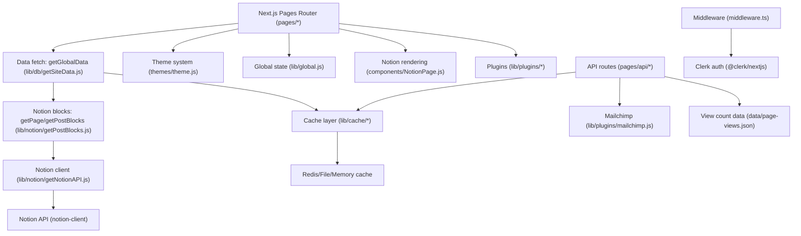
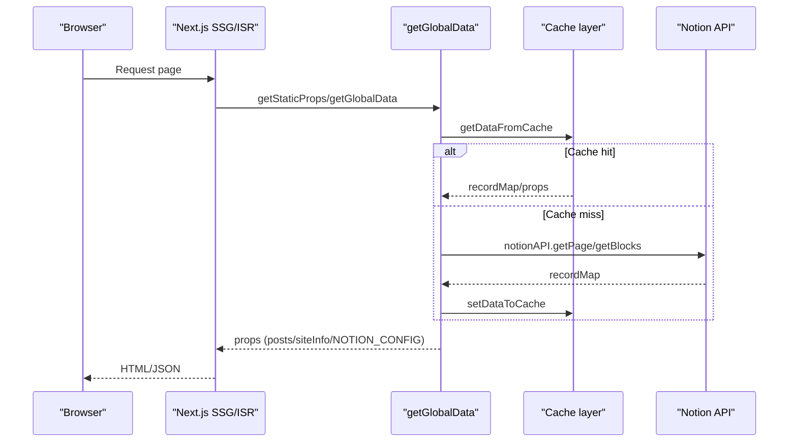
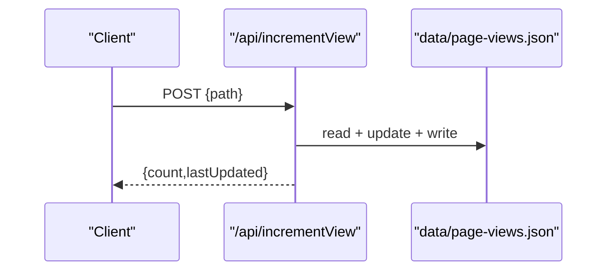

下面是基于当前代码库的结构化分析（不做代码修改）。我引用的关键位置都标了绝对路径，方便你快速定位。

**项目架构概览**
这是一个基于 Next.js Pages Router 的博客/内容站点，内容源自 Notion 数据库，通过 `notion-client` 拉取并转为站点数据，再交由主题系统动态渲染。站点支持多主题、国际化前缀路由、SSG/ISR、缓存层（内存/文件/Redis）以及多种第三方插件（评论、统计、搜索、AI 摘要）。核心数据入口是 `getGlobalData`，核心渲染是 `DynamicLayout` + `NotionPage`。

**主要目录结构及其职责**
- `/Users/Work/Frontend_Projects/MFNotionNext/pages`：页面路由与 SSG/ISR 数据拉取入口，含 `/api` API 路由。
- `/Users/Work/Frontend_Projects/MFNotionNext/lib`：核心业务逻辑层（Notion 获取、缓存、配置、工具函数、插件集成）。
- `/Users/Work/Frontend_Projects/MFNotionNext/components`：UI 与功能组件集合，含 Notion 渲染、评论、统计、AI、广告等。
- `/Users/Work/Frontend_Projects/MFNotionNext/themes`：主题目录与主题切换逻辑，动态加载布局与主题配置。
- `/Users/Work/Frontend_Projects/MFNotionNext/conf`：拆分配置模块（评论、统计、文章、插件等）。
- `/Users/Work/Frontend_Projects/MFNotionNext/data`：运行期数据文件（如阅读计数）。
- `/Users/Work/Frontend_Projects/MFNotionNext/hooks`：React Hooks。
- `/Users/Work/Frontend_Projects/MFNotionNext/styles`：全局样式与主题增强样式。
- `/Users/Work/Frontend_Projects/MFNotionNext/public`：静态资源。
- `/Users/Work/Frontend_Projects/MFNotionNext/middleware.ts`：鉴权与 UUID 重定向中间件。

**关键模块的依赖关系图**

**核心类和接口的功能说明**
- `getGlobalData`：全站数据入口，拉取 Notion 数据并转为站点结构，负责分类/标签/导航/公告/配置等聚合。`/Users/Work/Frontend_Projects/MFNotionNext/lib/db/getSiteData.js`
- `getSiteDataByPageId`：以 Notion Database ID 拉取并整理成站点数据。`/Users/Work/Frontend_Projects/MFNotionNext/lib/db/getSiteData.js`
- `getPage` / `getPostBlocks`：获取页面块数据并做结构清洗、语言映射、媒体 URL 签名等处理。`/Users/Work/Frontend_Projects/MFNotionNext/lib/notion/getPostBlocks.js`
- `getPost`：通过页面 ID 拼装文章核心元数据（标题、封面、时间等）。`/Users/Work/Frontend_Projects/MFNotionNext/lib/notion/getNotionPost.js`
- `siteConfig`：统一配置读取入口，优先级为 Notion Config > env > `blog.config.js`。`/Users/Work/Frontend_Projects/MFNotionNext/lib/config.js`
- `GlobalContextProvider`：全局状态（主题、语言、登录态、Loading、配置等）。`/Users/Work/Frontend_Projects/MFNotionNext/lib/global.js`
- `DynamicLayout`：根据主题与路由动态加载布局组件。`/Users/Work/Frontend_Projects/MFNotionNext/themes/theme.js`
- `NotionPage`：将 Notion blockMap 渲染为页面，处理图片缩放、数据库/画册交互、Spoiler 文本等。`/Users/Work/Frontend_Projects/MFNotionNext/components/NotionPage.js`
- `cache_manager`：统一缓存接口，支持内存/文件/Redis。`/Users/Work/Frontend_Projects/MFNotionNext/lib/cache/cache_manager.js`
- `processPostData`：文章增强处理（目录、字数、AI 摘要、Algolia 全文索引、推荐文章）。`/Users/Work/Frontend_Projects/MFNotionNext/lib/utils/post.js`
- `CustomNotionApi`：面向 Notion API 的写入封装（当前未见导出使用）。`/Users/Work/Frontend_Projects/MFNotionNext/lib/notion/CustomNotionApi.ts`

**数据流向图**
主渲染链路（SSG/ISR）：

阅读计数链路：

**API接口清单**
- `GET /api/views?path=...`：读取指定页面的阅读次数。`/Users/Work/Frontend_Projects/MFNotionNext/pages/api/views.js`
- `POST /api/incrementView`：增加阅读次数。`/Users/Work/Frontend_Projects/MFNotionNext/pages/api/incrementView.js`
- `GET /api/fixViewCount`：修复阅读数据键名（去路径前缀）。`/Users/Work/Frontend_Projects/MFNotionNext/pages/api/fixViewCount.js`
- `GET /api/cache`：清理本地缓存。`/Users/Work/Frontend_Projects/MFNotionNext/pages/api/cache.js`
- `POST /api/subscribe`：Mailchimp 订阅。`/Users/Work/Frontend_Projects/MFNotionNext/pages/api/subscribe.js`
- `GET /api/user`：Clerk 登录态验证。`/Users/Work/Frontend_Projects/MFNotionNext/pages/api/user.ts`
- `GET /api/auth/callback/notion?code=...`：Notion OAuth 回调。`/Users/Work/Frontend_Projects/MFNotionNext/pages/api/auth/callback/notion.ts`

**常见的代码模式和约定**
- 配置读取统一走 `siteConfig`，优先级：Notion Config > 环境变量 > `blog.config.js`。`/Users/Work/Frontend_Projects/MFNotionNext/lib/config.js`
- 数据获取统一由 `getGlobalData` 驱动，并在返回前做字段脱敏和结构裁剪。`/Users/Work/Frontend_Projects/MFNotionNext/lib/db/getSiteData.js`
- 页面路由使用 SSG/ISR（`getStaticProps` + `revalidate`），多语言/多站点通过 `NOTION_PAGE_ID` 前缀映射。`/Users/Work/Frontend_Projects/MFNotionNext/pages/index.js`
- 主题系统通过 `DynamicLayout` 动态加载布局与主题配置，支持 query 级主题切换。`/Users/Work/Frontend_Projects/MFNotionNext/themes/theme.js`
- 文章处理流程集中在 `processPostData`，包含目录/字数/AI/索引/推荐。`/Users/Work/Frontend_Projects/MFNotionNext/lib/utils/post.js`
- 缓存统一由 `cache_manager` 路由到内存/文件/Redis。`/Users/Work/Frontend_Projects/MFNotionNext/lib/cache/cache_manager.js`
- 视图统计采用文件型存储 `data/page-views.json`，由 API 读写维护。`/Users/Work/Frontend_Projects/MFNotionNext/data/page-views.json`

如果你需要更细的模块依赖图或完整 API 文档化输出，我可以继续扩展。  
下一步建议：
1. 要不要我生成一份“按页面路由”的数据流与主题渲染说明？
2. 是否需要把 `/api` 以 OpenAPI 格式输出？